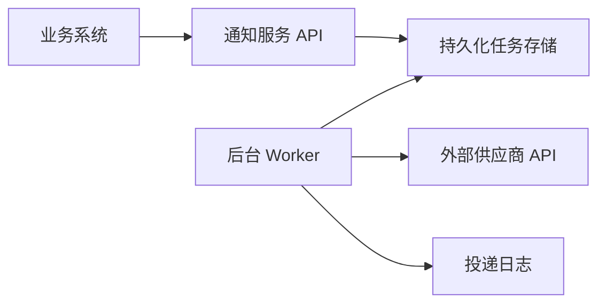

# API 通知系统设计与实现

## 1. 问题理解

企业内部多个业务系统会在关键事件发生后，需要调用外部供应商的 HTTP(S) API 完成通知，例如：

- 用户注册成功后通知广告系统。
- 用户订阅付款成功后通知 CRM。
- 用户购买商品后通知库存系统。

这些外部 API 的地址、Header、Body 格式都不相同。业务系统本身不关心外部 API 的业务返回值，只希望“通知请求能够尽可能稳定、可靠地送达”。

因此，本系统的核心目标不是把外部 API 调用包装成同步 RPC，而是提供一个内部的异步通知投递服务：

1. 接收业务系统提交的通知任务。
2. 持久化通知任务，避免请求在服务重启或短暂故障时丢失。
3. 后台异步投递 HTTP 请求。
4. 对失败请求进行有限重试。
5. 记录任务状态，便于排查和人工处理。

## 2. 系统边界

### 2.1 本系统解决的问题

- 提供统一的内部通知提交入口。
- 支持不同外部供应商的 URL、Method、Header、Body。
- 将业务系统与外部 API 调用解耦，避免业务主流程被外部系统拖慢。
- 对通知任务进行持久化存储。
- 提供至少一次投递语义。
- 对网络错误、超时、5xx 等临时失败进行重试。
- 对长期失败的任务标记为失败，保留错误信息，方便后续人工排查或补偿。

### 2.2 本系统暂不解决的问题

- 不保证外部系统最终一定完成业务处理。
  - 原因：外部系统可能长期不可用、接口变更、鉴权失效或业务拒绝请求，内部系统无法完全控制。
- 不解析不同供应商返回值中的复杂业务语义。
  - 原因：题目中说明业务系统不关心外部 API 的返回值。第一版只按 HTTP 状态、超时和网络错误判断投递是否成功。
- 不提供复杂的供应商协议编排能力。
  - 原因：第一版更关注可靠投递主链路，复杂字段映射、模板系统、签名插件化可以后续演进。
- 不实现 exactly-once 投递。
  - 原因：HTTP 调用天然难以做到严格 exactly-once。请求可能已经到达外部系统，但内部服务在读取响应前超时。强行追求 exactly-once 会显著增加复杂度，并且需要外部系统配合幂等。
- 不在 MVP 中引入 Kafka、RabbitMQ、分布式调度等大型基础设施。
  - 原因：作业规模有限，先用本地持久化任务文件和后台 worker 就能表达核心设计。未来流量上来后再演进到数据库或消息队列。

## 3. 核心设计

### 3.1 整体架构



系统包含三个核心模块：

- API 层：接收业务系统提交的通知请求，完成基础校验后写入持久化任务存储。
- 存储层：保存通知任务、投递状态、重试次数、下一次重试时间和错误信息。
- Worker 层：扫描待投递任务，执行 HTTP 请求，根据结果更新状态或安排下一次重试。

### 3.2 通知任务模型

一条通知任务至少包含：

- `id`：通知任务 ID。
- `target_url`：外部 API 地址。
- `method`：HTTP 方法，默认 `POST`。
- `headers`：请求头。
- `body`：请求体。
- `status`：任务状态，例如 `pending`、`processing`、`success`、`failed`。
- `attempt_count`：已尝试次数。
- `max_attempts`：最大尝试次数。
- `next_retry_at`：下一次可重试时间。
- `last_error`：最近一次错误信息。
- `created_at` / `updated_at`：创建和更新时间。

### 3.3 API 设计

第一版提供一个最小提交接口：

```http
POST /notifications
Content-Type: application/json
```

请求示例：

```json
{
  "target_url": "https://vendor.example.com/hooks/register",
  "method": "POST",
  "headers": {
    "Authorization": "Bearer xxx",
    "Content-Type": "application/json"
  },
  "body": {
    "user_id": "u_123",
    "event": "user_registered"
  },
  "max_attempts": 5
}
```

响应示例：

```json
{
  "notification_id": "ntf_123",
  "status": "pending"
}
```

API 只表示任务已被系统接收，不表示外部系统已经处理成功。

### 3.4 投递语义

本系统选择“至少一次”投递语义。

原因：

- 通知场景更关注不要漏投。
- HTTP 调用在超时、连接中断、服务重启等情况下，调用方无法总是判断外部系统是否已经收到请求。
- “至少一次”实现成本低、工程上可解释，也符合大多数 webhook / notification 系统的常见做法。

对应要求：

- 外部供应商或业务事件本身最好支持幂等，例如通过 `event_id`、`order_id`、`notification_id` 等字段去重。
- 如果外部系统不支持幂等，则需要业务方接受重复通知风险，或者在后续版本中为特定供应商增加去重与补偿策略。

## 4. 可靠性与失败处理

### 4.1 成功与失败判断

第一版规则：

- HTTP `2xx`：认为投递成功。
- HTTP `408`、`429`、`5xx`、网络错误、连接超时、读取超时：认为可重试失败。
- HTTP `4xx` 中除 `408`、`429` 之外的状态：默认认为不可重试失败。

这个规则不是绝对真理，但适合作为第一版默认策略。后续可以为不同供应商配置可重试状态码。

### 4.2 重试策略

采用指数退避加上最大次数限制：

- 第 1 次失败：约 1 分钟后重试。
- 第 2 次失败：约 5 分钟后重试。
- 第 3 次失败：约 15 分钟后重试。
- 第 4 次失败：约 1 小时后重试。
- 超过 `max_attempts` 后标记为 `failed`。

重试时可以加入少量 jitter，避免大量任务在同一时间集中重试。

### 4.3 外部系统长期不可用

如果外部系统长期不可用：

1. 任务会按退避策略重试。
2. 达到最大次数后进入 `failed` 状态。
3. 系统保留错误原因和最后一次响应信息。
4. 后续可以提供人工重放接口，例如 `POST /notifications/{id}/retry`。

MVP 可以先不实现人工重放接口，但数据模型中保留支持空间。

### 4.4 Worker 并发与任务锁定

如果有多个 Worker 同时运行，需要避免同一任务被重复取出执行。

MVP 是单进程 Worker，不需要处理多个进程同时抢同一任务的问题。进程内通过同步仓储方法保证同一时刻只有一个线程修改任务文件。

如果后续扩展为多个 Worker 实例，可以使用数据库字段实现简单锁定：

- Worker 取任务时把状态从 `pending` 更新为 `processing`。
- 更新条件中带上原始状态，确保只有一个 Worker 成功抢到任务。
- 如果服务在 `processing` 状态中崩溃，可以通过 `updated_at` 超时扫描，把卡住的任务重新置为 `pending`。

## 5. Java MVP 实现

本仓库实现了一个纯 Java 标准库版本的 MVP，不依赖 Spring、Maven、Gradle 或第三方库。

技术选择：

- 语言：Java。
- HTTP 服务：JDK 自带 `com.sun.net.httpserver.HttpServer`。
- HTTP 客户端：JDK 自带 `java.net.http.HttpClient`。
- 存储：本地 JSON 文件 `data/notifications.json`。
- 后台任务：进程内 Worker 循环扫描到期任务。
- JSON：项目内实现了一个轻量 JSON parser / serializer，只覆盖本作业需要的 JSON 对象、数组、字符串、数字、布尔值和 null。

选择纯 Java 的原因：

- 当前作业重点是可靠投递的工程设计，不是框架能力展示。
- 无外部依赖，评审者只需要 JDK 即可编译运行。
- 任务持久化、状态流转、HTTP 投递、失败重试等核心逻辑都能完整表达。
- 后续迁移到 Spring Boot、PostgreSQL 或消息队列时，核心模型不需要推翻。

项目结构：

```text
.
├── README.md
├── scripts/
│   ├── compile.ps1
│   └── run.ps1
└── src/
    └── main/
        └── java/
            └── com/
                └── example/
                    └── notification/
                        ├── Main.java
                        ├── NotificationServer.java
                        ├── DeliveryWorker.java
                        ├── DeliveryClient.java
                        ├── TaskRepository.java
                        ├── NotificationTask.java
                        ├── TaskStatus.java
                        ├── DeliveryResult.java
                        └── Json.java
```

### 5.1 运行方式

需要本机安装 JDK 17 或更高版本，并确保 `java`、`javac` 在 PATH 中。

编译：

```powershell
.\scripts\compile.ps1
```

运行：

```powershell
.\scripts\run.ps1
```

如果 PowerShell 禁止执行脚本，可以使用：

```powershell
powershell -ExecutionPolicy Bypass -File .\scripts\run.ps1
```

也可以使用 Gradle：

```powershell
gradle build
gradle run
```

默认启动地址：

```text
http://localhost:8080
```

可通过环境变量调整：

- `PORT`：服务端口，默认 `8080`。
- `DATA_FILE`：任务持久化文件，默认 `data/notifications.json`。

### 5.2 接口示例

健康检查：

```http
GET /health
```

提交通知任务：

```http
POST /notifications
Content-Type: application/json
```

```json
{
  "target_url": "https://vendor.example.com/hooks/register",
  "method": "POST",
  "headers": {
    "Authorization": "Bearer xxx",
    "Content-Type": "application/json"
  },
  "body": {
    "user_id": "u_123",
    "event": "user_registered"
  },
  "max_attempts": 5
}
```

响应：

```json
{
  "notification_id": "ntf_xxx",
  "status": "pending"
}
```

查询任务：

```http
GET /notifications/{notification_id}
```

手动重试失败任务：

```http
POST /notifications/{notification_id}/retry
```

## 6. 关键工程取舍

### 6.1 为什么不用同步调用外部 API

同步调用会让业务系统直接承受外部系统的延迟和失败。如果广告系统、CRM 或库存系统变慢，业务主流程也会变慢，甚至失败。

异步通知服务可以把“业务事件已发生”和“外部通知已送达”拆开，业务系统只需要确认通知任务被接收。

### 6.2 为什么第一版不直接上消息队列

消息队列可以提升吞吐和解耦能力，但也会引入额外运维复杂度，包括：

- 队列部署和监控。
- 消费者组管理。
- 死信队列设计。
- 消息重复消费处理。
- 本地开发和评审成本。

本作业更关注设计判断。第一版使用本地 JSON 文件足以展示任务持久化、状态流转和失败重试。后续如果吞吐量、延迟或水平扩展需求上升，再引入数据库或消息队列更合理。

### 6.3 为什么不追求 exactly-once

HTTP 投递无法单方面保证 exactly-once。典型问题是：

1. 通知服务发出了请求。
2. 外部系统已经处理成功。
3. 通知服务等待响应时超时。
4. 通知服务无法判断该重试还是不重试。

所以本系统选择至少一次，并建议外部系统或业务事件支持幂等键。

## 7. 未来演进

如果系统流量或复杂度明显增长，可以按阶段演进：

1. 存储从本地 JSON 文件升级到 PostgreSQL。
2. Worker 从单进程升级到多实例，并使用数据库行锁或队列保证并发安全。
3. 引入消息队列，例如 RabbitMQ、Kafka、SQS，用于削峰和水平扩展。
4. 增加死信队列和人工重放后台。
5. 增加供应商配置中心，支持不同供应商的重试策略、超时时间、鉴权方式和签名规则。
6. 增加投递观测能力，包括成功率、失败率、重试次数、供应商维度延迟和告警。
7. 增加幂等键规范，要求业务系统提交 `event_id`，并在投递时透传给外部系统。
8. 增加限流和熔断，避免外部系统故障时被重试流量进一步打垮。

## 8. AI 使用说明

### 8.1 AI 提供帮助的地方

- 协助阅读和拆解作业说明，提取出系统边界、可靠性、失败处理、取舍与演进这些核心回答点。
- 协助整理通知系统的常见架构，包括 API 接收、任务持久化、后台 Worker、重试和状态记录。
- 协助把设计取舍写成更适合 README 展示的结构化文档。

### 8.2 AI 曾给出但未采纳的方向

- 没有采纳一开始就使用 Kafka / RabbitMQ 的重型方案。
  - 原因：本作业建议投入时间不超过 4 小时，第一版使用本地持久化任务文件更能体现核心逻辑，复杂中间件会分散重点。
- 没有采纳 exactly-once 的投递目标。
  - 原因：HTTP 通知场景中 exactly-once 需要外部系统配合幂等和事务语义，单靠通知服务无法可靠保证。
- 没有采纳复杂的供应商适配 DSL 或插件系统。
  - 原因：第一版主要解决可靠投递，不应该提前设计过重的抽象。

### 8.3 我自己做出的关键决策

- 选择至少一次投递语义。
  - 原因：通知类系统更怕漏投，重复投递可以通过幂等键降低影响。
- 选择本地 JSON 文件作为 MVP 的可靠性基础。
  - 原因：实现简单、可解释、易评审，能够覆盖任务持久化和失败重试。
- 选择有限重试加失败落库，而不是无限重试。
  - 原因：外部系统长期不可用时，无限重试会持续占用资源，也不利于问题定位。
- 将业务系统与外部 API 返回值解耦。
  - 原因：业务系统不关心外部返回值，只需要知道通知任务已被接收。
